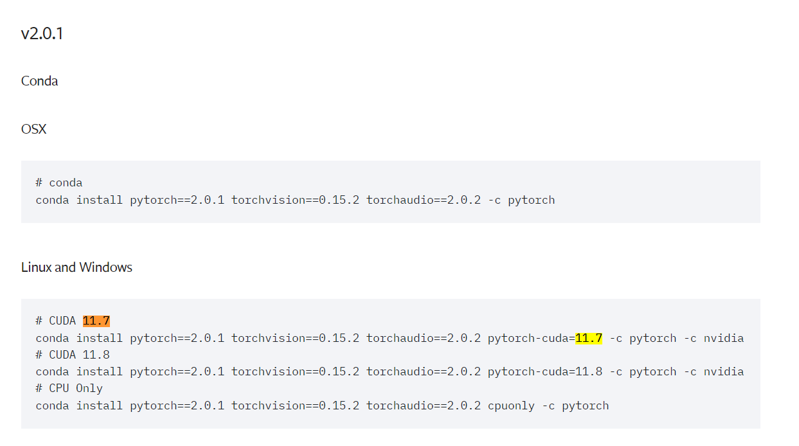

# 中文命名实体识别

项目修改自
https://github.com/taishan1994/pytorch_bert_bilstm_crf_ner
在原项目的基础上，修改了模型，添加了加性注意力的实现，增加了tensorboard的log保存，增加了JSON2BIO脚本，字典标记脚本、数据增强脚本。


首先下载[Anaconda](https://mirrors.tuna.tsinghua.edu.cn/anaconda/archive/Anaconda3-2023.09-0-Windows-x86_64.exe)

在安装完成后，修改Anaconda的镜像源为清华源：
打开 ~/.condarc文件，如果没有该文件的话，运行 `conda config --set show_channel_urls yes` 生成。
```shell
channels:
  - defaults
show_channel_urls: true
default_channels:
  - https://mirrors.tuna.tsinghua.edu.cn/anaconda/pkgs/main
  - https://mirrors.tuna.tsinghua.edu.cn/anaconda/pkgs/r
  - https://mirrors.tuna.tsinghua.edu.cn/anaconda/pkgs/msys2
custom_channels:
  conda-forge: https://mirrors.tuna.tsinghua.edu.cn/anaconda/cloud
  msys2: https://mirrors.tuna.tsinghua.edu.cn/anaconda/cloud
  bioconda: https://mirrors.tuna.tsinghua.edu.cn/anaconda/cloud
  menpo: https://mirrors.tuna.tsinghua.edu.cn/anaconda/cloud
  pytorch: https://mirrors.tuna.tsinghua.edu.cn/anaconda/cloud
  pytorch-lts: https://mirrors.tuna.tsinghua.edu.cn/anaconda/cloud
  simpleitk: https://mirrors.tuna.tsinghua.edu.cn/anaconda/cloud
  deepmodeling: https://mirrors.tuna.tsinghua.edu.cn/anaconda/cloud/
```

修改完成后，运行 `conda clean -i` 清除索引缓存，保证用的是镜像站提供的索引。

使用conda创建虚拟Python环境： demo 替换为新的虚拟环境的名称。在复现深度学习的数据集中，通常推荐python环境在3.6~3.9之间，如果成果较新，推荐3.10以上版本。
```shell
conda create --name demo python=3.x
```

然后通过 `conda activate demo` 命令，将虚拟环境切换到新建的环境中。

首先安装pytorch,该项目基于CUDA11.7 + PyTorch 2.0.1.

在PyTorch的环境配置中，一般根据[Torch的文档](https://pytorch.org/get-started/previous-versions/)找到PyTorch匹配的CUDA版本，


根据搜索的的版本，运行安装命令，对于Windows来说，最好使用conda命令安装cuda和torch.

CUDA和PyTorch安装完成之后,安装以下版本的软件包

```shell
scikit-learn==1.1.3 
scipy==1.10.1 
seqeval==1.2.2
transformers==4.27.4
pytorch-crf==0.7.2
tensorboard
pandas
```

具体来说，就是运行以下命令

```shell
pip install scikit-learn==1.1.3 scipy==1.10.1 seqeval==1.2.2 transformers==4.27.4 pytorch-crf==0.7.2 tensorboard pandas
```


# 目录结构

```shell
--checkpoint：模型和配置保存位置
--model_hub：预训练模型
----chinese-bert-wwm-ext:
--------vocab.txt
--------pytorch_model.bin
--------config.json
--data：存放数据
----dgre
--------ori_data：原始的数据
--------ner_data：处理之后的数据
------------labels.txt：标签
------------train.txt：训练数据
------------dev.txt：测试数据
--config.py：配置
--model.py：模型
--process_my_data.py：处理ori数据得到ner数据
--predict.py：加载训练好的模型进行预测
--main.py：训练和测试
```

# 说明

这里以dgre数据为例，其余数据类似。

```shell
1、去https://huggingface.co/hfl/chinese-bert-wwm-ext/tree/main下载相关文件到chinese-bert-wwm-ext下。

2、在process.py里面定义将ori_data里面的数据处理得到ner_data下的数据，ner_data下数据样本是这样的：
--labels.txt
故障设备
故障原因
--train.txt/dev.txt
{"id": "AT0001", "text": ["6", "2", "号", "汽", "车", "故", "障", "报", "告", "综", "合", "情", "况", ":", "故", "障", "现", "象", ":", "加", "速", "后", "，", "丢", "开", "油", "门", "，", "发", "动", "机", "熄", "火", "。"], "labels": ["O", "O", "O", "O", "O", "O", "O", "O", "O", "O", "O", "O", "O", "O", "O", "O", "O", "O", "O", "O", "O", "O", "O", "O", "O", "O", "O", "O", "B-故障设备", "I-故障设备", "I-故障设备", "B-故障原因", "I-故障原因", "O"]}
一行一条样本，格式为BIO。

3、在config.py里面定义一些参数，比如：
--max_seq_len：句子最大长度，GPU显存不够则调小。
--epochs：训练的epoch数
--train_batch_size：训练的batchsize大小，GPU显存不够则调小。
--dev_batch_size：验证的batchsize大小，GPU显存不够则调小。
--save_step：多少step保存模型
其余的可保持不变。

4、在main.py里面修改data_name为数据集名称。需要注意的是名称和data下的数据集名称保持一致。最后运行：python main.py

5、在predict.py修改data_name并加入预测数据，最后运行：python predict.py
```

## Bert-bigru-crf

```shell
max_seq_len=128
train_batch_size=32
dev_batch_size=32
save_step=500
epochs=3
```

```shell
              precision    recall  f1-score  support
储层类型           0.809524  0.784615  0.796875     65.0
地区             0.795349  0.838235  0.816229    204.0
岩石             0.939058  0.963068  0.950912    352.0
岩石地层           0.954918  0.935743  0.945233    249.0
年代地层           0.887850  0.887850  0.887850    107.0
沉积相            0.881818  0.915094  0.898148    106.0
盆地构造           0.861111  0.953846  0.905109     65.0
micro avg      0.894198  0.912892  0.903448   1148.0
macro avg      0.875661  0.896922  0.885765   1148.0
weighted avg   0.895155  0.912892  0.903682   1148.0

```

在训练完成之后，运行predict.py文件，可以实时预测命名实体识别的结果。

```shell
====================================================================================================
文本>>>>>： 湖北大冶市杨文昌至许家湾白垩系下统大寺组二段（K1d2）－四段（K1d4）实测地层岩相剖面（PM017）（图2-41）未见顶大寺组四段（K1d4）56.浅灰紫色安山岩与安山质火山角砾岩互层。
实体>>>>>： {'地区': [('湖北', 0, 1), ('大冶市', 2, 4), ('杨文昌至许家湾', 5, 11)], '年代地层': [('白垩系下统', 12, 16), ('顶大', 61, 62)], '岩石地层': [('大寺组二段', 17, 21), ('四段', 29, 30), ('寺组四段', 63, 66)], '岩石': [('浅灰', 76, 77), ('安山岩', 80, 82), ('安山质火山角砾岩', 84, 91)]}
====================================================================================================
文本>>>>>： 以变泥砂质岩中有细小鳞片状绢云母大量出现为特征。说明该变质带特征变质矿物以绿泥石—绢云母为主，变质程度较低。
实体>>>>>： {'岩石': [('变泥砂质岩', 1, 5)]}
====================================================================================================
文本>>>>>： 流纹岩：出露于阳春市山表村附近，岩石呈灰色块状，发育条带状流动构造，具斑状结构。
实体>>>>>： {'岩石': [('流纹岩', 0, 2)], '地区': [('阳春市', 7, 9)]}
====================================================================================================
```
## 实验曲线分析

采用Tensorboard作为实验可视化工具。

```shell
pip install tensorboard
```

当实验完成后，可通过指定实验结果目录来查看实验结果。

```shell
tensorboard --logdir=E:\BERT-BILSTM-CRF\logs\test
```


## 数据集准备

推荐使用LABEL-STUDIO进行数据集准备
要使用 pip 安装 Label Studio，需要 Python 版本 3.8 或更高版本。运行以下命令：

```shell
python -m pip install label-studio
# 启动label-studio
label-studio
```

标记完成后，使用json2BIO.py函数，将数据集的JSON格式数据集：

转化为标准NER格式数据集：


### 标注加速策略

### 弱监督标注方式（词典标注）

弱监督（Weak Supervision）是一种机器学习方法，它介于无监督学习和完全监督学习之间。在弱监督学习中，模型的训练不是基于精确和完整标记的数据集（像在完全监督学习中那样），而是使用不完全、不精确或部分标记的数据。这种方法对于那些难以获得大量精确标记数据的场景特别有用。
脚本`prepare_weaksupervised_data.py`主要用于将文本数据集通过 jieba 进行分词和实体标记，然后根据指定的比例划分为训练集、验证集和测试集。


### 模型加速标注方法

首先安装label-studio-ml,然后创建一个ML后端
```shell
git clone https://github.com/HumanSignal/label-studio-ml-backend.git
cd label-studio-ml-backend/

pip install -U -e .
label-studio-ml create my_ml_backend
```

该后端创建完毕后，目录结构如下所示：
```shell

my_ml_backend/
├── Dockerfile
├── docker-compose.yml
├── model.py
├── _wsgi.py
├── README.md
└── requirements.txt
```
主要方法依然是编写model，完成后端的预测。这里可以看我上传的ml后端的实现方法。

然后启动ML后端
```shell
label-studio-ml start my_ml_backend
```


这样就算完成了

在预测的时候，使用LABEL-STUDIO链接后端即可


