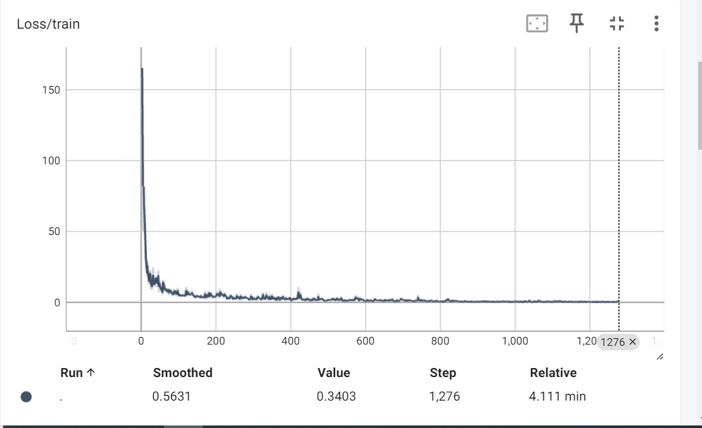
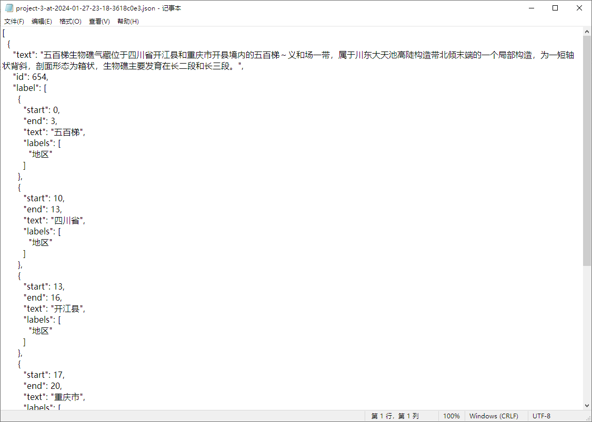
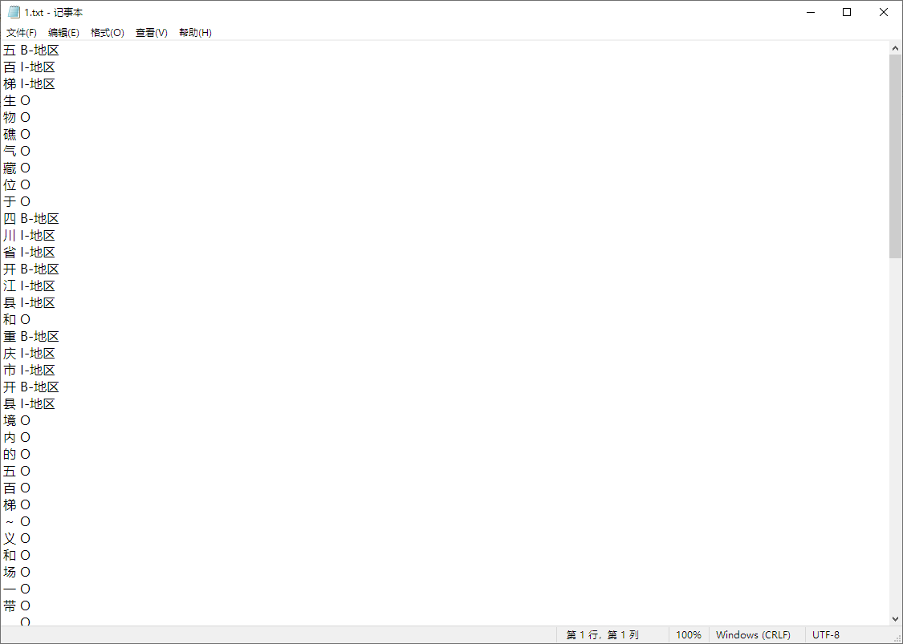
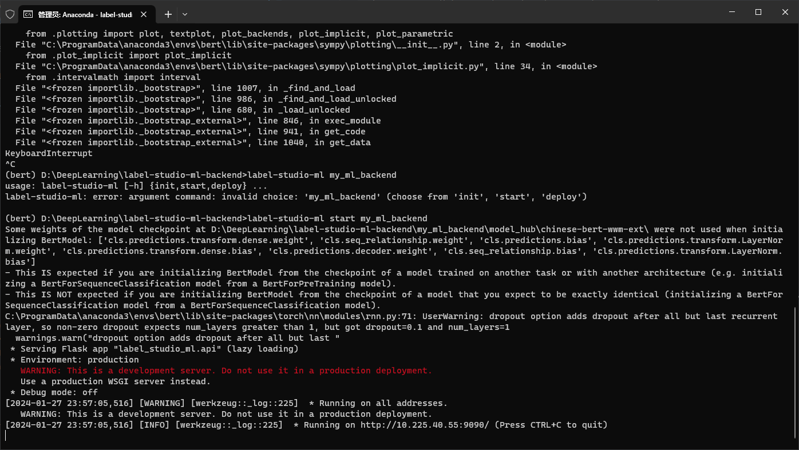

## Chinese Named Entity Recognition Code Repositories of Paper "Accelerating the Exploration of Information in Chinese Geological Texts Using Pretrained Model and Self Attention"
The project is modified from
https://github.com/taishan1994/pytorch_bert_bilstm_crf_ner
On the basis of the original project, the model was improved and an additional additive attention implementation was added, the TensorBoard log was increased, a JSON2BIO script, a dictionary tag script, and a data enhancement script were added.


```shell
scikit-learn==1.1.3 
scipy==1.10.1 
seqeval==1.2.2
transformers==4.27.4
pytorch-crf==0.7.2
tensorboard
pandas
```

Actually,you only just need to run this command:
```shell
pip install scikit-learn==1.1.3 scipy==1.10.1 seqeval==1.2.2 transformers==4.27.4 pytorch-crf==0.7.2 tensorboard pandas
```


## Structure of Catalog

```shell
--checkpoint：Checkpoint location for model and configuration
--model_hub：Pre-trained model
----chinese-bert-wwm-ext:
--------vocab.txt
--------pytorch_model.bin
--------config.json
--data：Data directory
----dgre
--------ori_data：Raw data
--------ner_data：Processed data
------------labels.txt：Labels
------------train.txt：Training data
------------dev.txt：Test data
--config.py：Configuration
--model.py：Model
--process_my_data.py：Converts ori data to ner data
--predict.py：Predicts using the trained model
--main.py：Training and testing
```

## Introduction

The geo2 data is used here as an example; other data is similar.


1. Kindly head over to this link: https://huggingface.co/hfl/chinese-bert-wwm-ext/tree/main in order to procure the requisite files; subsequently transfer these files under 'chinese-bert-wwm-ext'.

2. Define - within the 'process_my_daya.py' file - how to process the data contained within 'ori_data' so as to arrive at the data under 'ner_data'; a data sample under 'ner_data' should appear as follows:
--labels.txt

  Rock
  Lithostratigraphy
  Chronostratigraphy
  Sedimentary facies
  Basin structure
  Region
  Reservoir type
--train.txt/dev.txt
{"id": "AT7883", "text": ["桩", "3", "9", "井", "区", "沙", "三", "上", "段", "为", "辫", "状", "河", "三", "角", "洲", "相", "，", "可", "划", "分", "为", "水", "下", "分", "流", "河", "道", "、", "河", "口", "坝", "、", "坝", "缘", "及", "席", "状", "砂", "、", "水", "道", "间", "及", "湖", "相", "、", "溢", "岸", "五", "个", "沉", "积", "微", "相", "，", "图", "2", "-", "7", "为", "沙", "三", "上", "段", "Ⅳ", "-", "1", "小", "层", "沉", "积", "微", "相", "图", "；", "沙", "三", "下", "段", "为", "扇", "三", "角", "洲", "相", "，", "亦", "可", "划", "分", "为", "水", "下", "分", "流", "河", "道", "、", "河", "口", "坝", "、", "坝", "缘", "及", "席", "状", "砂", "、", "水", "道", "间", "及", "湖", "相", "、", "溢", "岸", "五", "个", "沉", "积", "微", "相", "，", "图", "2", "-", "8", "为", "沙", "三", "下", "段", "Ⅱ", "-", "3", "小", "层", "沉", "积", "微", "相", "图", "。"], "labels": ["O", "O", "O", "O", "O", "B-岩石地层", "I-岩石地层", "I-岩石地层", "I-岩石地层", "O", "B-沉积相", "I-沉积相", "I-沉积相", "I-沉积相", "I-沉积相", "I-沉积相", "I-沉积相", "O", "O", "O", "O", "O", "B-沉积相", "I-沉积相", "I-沉积相", "I-沉积相", "I-沉积相", "I-沉积相", "O", "B-沉积相", "I-沉积相", "I-沉积相", "O", "B-沉积相", "I-沉积相", "I-沉积相", "I-沉积相", "I-沉积相", "I-沉积相", "O", "B-沉积相", "I-沉积相", "I-沉积相", "I-沉积相", "I-沉积相", "I-沉积相", "O", "B-沉积相", "I-沉积相", "O", "O", "O", "O", "O", "O", "O", "O", "O", "O", "O", "O", "O", "O", "O", "O", "O", "O", "O", "O", "O", "O", "O", "O", "O", "O", "O", "B-岩石地层", "I-岩石地层", "I-岩石地层", "I-岩石地层", "O", "B-沉积相", "I-沉积相", "I-沉积相", "I-沉积相", "I-沉积相", "O", "O", "O", "O", "O", "O", "B-沉积相", "I-沉积相", "I-沉积相", "I-沉积相", "I-沉积相", "I-沉积相", "O", "B-沉积相", "I-沉积相", "I-沉积相", "O", "B-沉积相", "I-沉积相", "I-沉积相", "I-沉积相", "I-沉积相", "I-沉积相", "O", "B-沉积相", "I-沉积相", "I-沉积相", "I-沉积相", "I-沉积相", "I-沉积相", "O", "B-沉积相", "I-沉积相", "O", "O", "O", "O", "O", "O", "O", "O", "O", "O", "O", "O", "B-岩石地层", "I-岩石地层", "I-岩石地层", "I-岩石地层", "I-岩石地层", "I-岩石地层", "I-岩石地层", "I-岩石地层", "I-岩石地层", "O", "O", "O", "O", "O", "O"]}

3. Define certain parameters within 'config.py', such as:
--max_seq_len: denoting the utmost sentence length; should GPU memory prove insufficient, this value may be decreased.
--epochs: the number of epochs to be utilized for training.
--train_batch_size: denoting the size of the batch to be utilized for training; should GPU memory prove insufficient, this value may be decreased.
--dev_batch_size: denoting the size of the batch to be utilized for development; should GPU memory prove insufficient, this value may be decreased.
--save_step: denoting after how many steps the model should be saved.
The remaining parameters may be retained in their current state.

4. 
Within the 'main.py' file, alter the 'data_name' to reflect the name of the dataset in question. It is imperative to ensure that this name is consistent with the name of the dataset present under 'data'. Finally, execute the following command: 'python main.py'.

5. 
Within the 'predict.py' file, modify the 'data_name' and incorporate the data to be predicted; finally, execute the following command: 'python predict.py'.

## BERT-BIGRU-CRF

```shell
max_seq_len=128
train_batch_size=32
dev_batch_size=32
save_step=500
epochs=3
```

```shell
              precision    recall  f1-score  support
储层类型           0.809524  0.784615  0.796875     65.0
地区             0.795349  0.838235  0.816229    204.0
岩石             0.939058  0.963068  0.950912    352.0
岩石地层           0.954918  0.935743  0.945233    249.0
年代地层           0.887850  0.887850  0.887850    107.0
沉积相            0.881818  0.915094  0.898148    106.0
盆地构造           0.861111  0.953846  0.905109     65.0
micro avg      0.894198  0.912892  0.903448   1148.0
macro avg      0.875661  0.896922  0.885765   1148.0
weighted avg   0.895155  0.912892  0.903682   1148.0

```

Once the training process has been completed, executing the 'predict.py' file will facilitate real-time prediction of NER outcomes.

```shell
====================================================================================================
文本>>>>>： 湖北大冶市杨文昌至许家湾白垩系下统大寺组二段（K1d2）－四段（K1d4）实测地层岩相剖面（PM017）（图2-41）未见顶大寺组四段（K1d4）56.浅灰紫色安山岩与安山质火山角砾岩互层。
实体>>>>>： {'地区': [('湖北', 0, 1), ('大冶市', 2, 4), ('杨文昌至许家湾', 5, 11)], '年代地层': [('白垩系下统', 12, 16), ('顶大', 61, 62)], '岩石地层': [('大寺组二段', 17, 21), ('四段', 29, 30), ('寺组四段', 63, 66)], '岩石': [('浅灰', 76, 77), ('安山岩', 80, 82), ('安山质火山角砾岩', 84, 91)]}
====================================================================================================
文本>>>>>： 以变泥砂质岩中有细小鳞片状绢云母大量出现为特征。说明该变质带特征变质矿物以绿泥石—绢云母为主，变质程度较低。
实体>>>>>： {'岩石': [('变泥砂质岩', 1, 5)]}
====================================================================================================
文本>>>>>： 流纹岩：出露于阳春市山表村附近，岩石呈灰色块状，发育条带状流动构造，具斑状结构。
实体>>>>>： {'岩石': [('流纹岩', 0, 2)], '地区': [('阳春市', 7, 9)]}
====================================================================================================
```
## 实验曲线分析

Tensorboard serves as an indispensable tool for the visualization of experimental data. 
Upon completion of an experiment, one can effortlessly scrutinize the experimental outcomes by specifying the directory containing said outcomes.

```shell
tensorboard --logdir=E:\BERT-BILSTM-CRF\logs\test
```



## 数据集准备

For efficient dataset preparation, LABEL-STUDIO is highly recommended. 
To use LABEL-STUDIO via pip, Python version 3.8 or above is required. Execute the following command:

```shell
python -m pip install label-studio
# 启动label-studio
label-studio
```

After the annotation process is complete, employ the 'json2BIO.py' function to transform the dataset's JSON format

convert it into the standard NER format dataset:


### Annotation acceleration strategies:

### Weakly supervised annotation methods (dictionary-based annotation)

Weak Supervision is a machine learning approach that falls in between unsupervised learning and fully supervised learning. In weakly supervised learning, models are trained on data that is not fully, accurately, or consistently labeled (like in the fully supervised learning paradigm), but rather using incomplete, inexact, or partial labels. This approach is particularly useful in scenarios where it is difficult or expensive to obtain large amounts of precisely labeled training data.

The script prepare_weaksupervised_data.py is primarily used to transform text datasets into word segmentation and entity-annotated data using jieba. It then splits the data into training, validation, and test sets based on a specified ratio.


### LABEL-STUDIO-ML-BACKEND

install label-studio-ml firstly,and then create a ml-backend:
```shell
git clone https://github.com/HumanSignal/label-studio-ml-backend.git
cd label-studio-ml-backend/

pip install -U -e .
label-studio-ml create my_ml_backend
```

Here is the directory structure of the project:
```shell

my_ml_backend/
├── Dockerfile
├── docker-compose.yml
├── model.py
├── _wsgi.py
├── README.md
└── requirements.txt
```
In models.py, the predict function should return the model's predictions for the given input data. This will allow the ml_backend to use the model to make predictions on the dataset.

```shell
label-studio-ml start my_ml_backend
```



